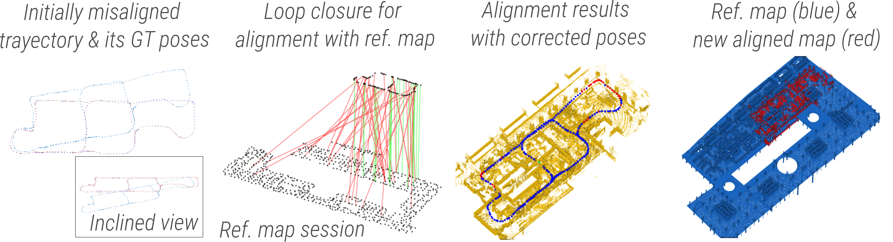
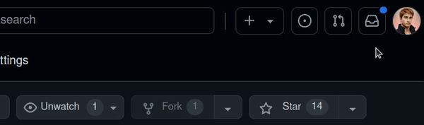

<h1 align="center" style="border-bottom: none">
    <b>
        ⭐️  ⭐️ <br>
	      Long-Term Mapping with 3D LiDAR and Reference Map Integration 
    </b>

 </h1>

[//]: # (      Advancing Long-Term Mapping with 3D LiDAR and Reference Map Integration for Precise 6-DoF Trajectory Estimation and Map Extension  )

<p align="center">
Align and correct your LiDAR-based SLAM data with a reference map or a previous session.
</p>


[//]: # (#### [[ArXiv Paper &#40;better images&#41;]&#40;https://arxiv.org/abs/2408.15948&#41;] [[Paper]&#40;https://link.springer.com/article/10.1007/s41693-024-001&#41;] [[Data]&#40;https://mediatum.ub.tum.de/1743877&#41;])


[//]: # (####  [![CMake on a single platform]&#40;https://github.com/MigVega/SLAM2REF/actions/workflows/cmake-single-platform.yml/badge.svg&#41;]&#40;https://github.com/MigVega/SLAM2REF/actions/workflows/cmake-single-platform.yml)


<p align="center">
    <a href="https://arxiv.org/abs/2408.15948"><b>ArXiv Paper (better images)</b></a> •
    <a href="https://link.springer.com/article/10.1007/s41693-024-00126-w"><b>Paper (nicer to read)</b></a> •
    <a href="https://mediatum.ub.tum.de/1743877"><b>Data</b></a>
</p>

<p align="center">
  <a href="https://github.com/MigVega/SLAM2REF/actions/workflows/cmake-single-platform.yml">
            
        </a>
  <a href="https://arxiv.org/abs/2408.15948">
    
  </a>
  <a href="https://youtu.be/5WgPRRijI4Y">
    
  </a>
  
  
  <a href="https://github.com/MigVega/SLAM2REF">
    
  </a>
  <a href="https://github.com/MigVega/SLAM2REF">
    
  </a>
  <a href="https://github.com/MigVega/SLAM2REF">
    
  </a>
</p>


[//]: # (  <a href="https://github.com/MigVega/SLAM2REF">)

[//]: # (    )

[//]: # (  </a>)
<!-- TO ADD -->
<!-- (https://paperswithcode.com/sota)-->


## What is SLAM2REF?
SLAM2REF uses pose-graph multi-session anchoring to align your LiDAR data with a reference map or with another session, allowing precise 6-DoF pose retrieval and map extension.
- This project is an extension of [LT-SLAM](https://github.com/gisbi-kim/lt-mapper/tree/main), which implements a custom GTSAM factor for anchoring (see BetweenFactorWithAnchoring.h). However, this project is completely ROS-independent. This is also an extension of the [BIM-SLAM](http://www.iaarc.org/publications/2023_proceedings_of_the_40th_isarc_chennai_india/bim_slam-integrating_bim_models_in_multi_session_slam_for_lifelong_mapping_using_3d_lidar.html) project, for which a [video](https://youtu.be/5WgPRRijI4Y) explanation is available.
- Moreover, we have implemented a novel Indoor Scan Context Descriptor for fast place recognition, which is an extension of [Scan Context](https://github.com/gisbi-kim/SC-A-LOAM). You can use this for fast global localization in indoor environments.
- Also, a novel YawGICP algorithm for robust point cloud registration with varying mostly yaw angles, this one is a particular implementation of the [Open 3D GICP](https://github.com/isl-org/Open3D/pull/3181). You can use this to register your sequential scans.
- SLAM2REF additionally allows the retrieval of 6-DoF poses with an accuracy of up to 3 cm given an accurate TLS point cloud as a reference map (this map should be accurate, at least regarding the position of permanent elements such as walls and columns). These poses are precise enough to serve as **ground truth** for evaluating state-of-the-art SLAM, localization, or pose estimation algorithms. Additionally, they can be used to retrieve an accurately updated and aligned map with the reference map, for example, to update a digital twin of a facility.

The following image presents a very brief overview of how the method works.
<p align="center"></p>


## How to Run the Code

### Compatibility Note

This project has been tested only on **Ubuntu 20.04**. While it may potentially run on **Ubuntu 22.04**, it would require the latest version of GTSAM and adjustments in the `BetweenFactorWithAnchoring` class to be compatible.


### 0. Installing the Dependencies
- We recommend installing GTSAM and Open 3D from the source. Moreover, you will need Open CV and PCL.
 
The commands to install all dependencies can be found in the file inside `.github/workflows`.


### 1. Cloning and Building the Project
- Run the following in a terminal to clone the repository.

```bash
    cd
    mkdir -p Repos/00.SLAM2REF/code
    cd Repos/00.SLAM2REF/code
    git clone https://github.com/MigVega/SLAM2REF .
  ```

- When building the project, use the `-j 5` flag to limit the process to five threads. This helps prevent the project from exiting prematurely. You can do that with a IDE or with the following comands in a terminal.

```bash
    cd
    cd Repos/00.SLAM2REF/code
    mkdir build
    cd build
    cmake ..
    make -j 5
```

### 2. Setting Up Directory Structure

- After a successful build, you need to set up the directory structure. Run the following commands in your terminal to create the necessary folders:

  ```bash
    cd
    mkdir -p Repos/00.SLAM2REF/data/outputs/00.TestA01_scans_in_BIM_ROI
    cd Repos/00.SLAM2REF/data
  ```
### 3. Download and Prepare Sample Data
- You can download sample data from [this link](https://drive.google.com/drive/folders/1-ay5U0WOnheeMLfr2lNsxzbV5TO6zF1O?usp=sharing) and unzip the file inside the `Repos/00.SLAM2REF/data` directory. Ensure that the "input" folder is more than 500 MB in size to confirm a successful download.

### 4. Configure the Project
- Open the `config/params.yaml` file and replace the three occurrences of `mlegion` with your Linux username.

### 5. Running the Code
- Start the execution by running the code. You should see the following in the console:      
    ```bash
        ----> Slam2ref starts.
    ```
- **Optional:** The **final ICP** step can significantly extend execution time (approximately 22 minutes). By default, it is deactivated to speed up the process. However, if you wish to refine the poses to centimeter accuracy, you can enable this step in a subsequent run.
    - To activate the final ICP step, open the `config/params.yaml` file and set the `using_MV_performing_final_ICP` parameter to `true`:

      ```yaml
      using_MV_performing_final_ICP: true
      ```

### 6. Monitoring Execution and Output

- The program's execution time varies depending on whether the **final ICP** step is included:
    - **Without final ICP:** Approximately less than 1 minute.
    - **With final ICP:** Approximately 22 minutes.

- Once the program has finished, you will see the following message in the console:
    ```bash
    ----> Slam2ref done.
    ```
 - Check the output files in [CloudCompare](https://www.cloudcompare.org/release/index.html) (all should be in `/home/[your-username]/Repos/00.SLAM2REF/data/outputs/00.TestA01_scans_in_BIM_ROI/TestA01`). Among the _.txt_ files, only the ones with _CC_ can be opened directly in CloudCompare.

- For instance, the file `!DLIO_real_world_SLAM_session_central_aft_KNN_intersession_loops_CC.txt` contains the poses in point cloud format of the real-world session after the ISC and KNN loops, which are aligned with the BIM model. In contrast, the original poses before these adjustments are in `!DLIO_real_world_SLAM_session_central_bfr_intersession_loops_CC.txt`. Additionally, you can view the original session poses from the BIM model in `!BIM_session_scans_296-422_central_bfr_intersession_loops_CC.txt`.
    - **Tip:** Increase the point size in your viewer to better visualize the poses.

- If you performed the **final ICP** step, you should also have a folder named "Part7_final_ICP". Inside, the file `!00_CENTRAL_SESSION_after_FinalICP_CC.txt` contains the further refined poses. In this file:
    - **Blue** denotes poses considered good,
    - **Green** denotes perfect poses,
    - **Red** denotes poses that are poor,
    - **Black** denotes scans outside the reference map where registration was not possible.

- The file `!FINAL_source_cloud_TOTAL.pcd` provides the map of the real-world session reconstructed using only the good and perfectly registered scans. You may need to colorize this map for better visualization. Compare this reconstructed map with the reference map located at `/home/[your-username]/Repos/00.SLAM2REF/data/inputs/01.Ref_maps_pcs`.


## Stay Up-to-Date / Support the Project

- **Upcoming Features:** We will be adding more code soon, including functionality to generate session data from the reference map.
- **Stay Informed:** To keep up with the latest updates and developments, make sure to watch and star the repository!

Your support helps us continue improving the project. Thank you for being part of our community!

<p align="center"></p>


## License

- **Academic Use:** The code is available under the [GPLv3 License](https://www.gnu.org/licenses/gpl-3.0.en.html) for academic purposes.
- **Commercial Use:** For any commercial applications, please contact the author at `mavtarturo@hotmail.com` to discuss licensing options.

## Citation

If you use this work or our data in your research, please cite it appropriately. 
The following BibTeX entries are the most accurate versions available:

**Paper & Data:**
The data consists of the BIM Model of [ConSLAM](https://github.com/mac137/ConSLAM) and Ground Truth poses.

```BibTeX
@article{SLAM2REF:vega2024:paper,
	title        = {{SLAM2REF}: advancing long-term mapping with {3D} {LiDAR} and reference map integration for precise 6-{DoF} trajectory estimation and map extension},
	author       = {Vega-Torres, Miguel A. and Braun, Alexander and Borrmann, André},
	year         = 2024,
	month        = 7,
	journal      = {Construction Robotics},
	publisher    = {Springer},
	volume       = 8,
	number       = 2,
	pages        = 13,
	doi          = {10.1007/s41693-024-00126-w},
	url          = {https://link.springer.com/article/10.1007/s41693-024-00126-w},
	notes        = {link to code: https://github.com/MigVega/SLAM2REF/. Link to data: https://mediatum.ub.tum.de/1743877},
	keywords     = {LiDAR; Multi-Session SLAM; Pose-Graph Optimization; Loop Closure; Long-term Mapping; Change Detection; {BIM} Update; {3D} Indoor Localization and Mapping},
	language     = {en}
}

@inproceedings{BIM_SLAM:vega:2023,
	author = {Vega-Torres, Miguel A. and Braun, A. and Borrmann, A.},
        title = {{BIM-SLAM: Integrating BIM Models in Multi-session SLAM for Lifelong Mapping using 3D LiDAR}},
	booktitle = {Proc. of the 40th International Symposium on Automation and Robotics in Construction (ISARC 2023)},
	year = {2023},
	month = {07},
        isbn = {978-0-6458322-0-4},
	doi = {10.22260/ISARC2023/0070},
	keywords = {BIM; LiDAR; SLAM },
	url = {http://www.iaarc.org/publications/2023_proceedings_of_the_40th_isarc_chennai_india/bim_slam-integrating_bim_models_in_multi_session_slam_for_lifelong_mapping_using_3d_lidar.html},
}

@misc{SLAM2REF:vega2024:data,
	title        = {{ConSLAM} {BIM} and {GT} Poses},
	author       = {Vega-Torres, Miguel A. and Braun, Alexander and Borrmann, André},
	year         = 2024,
	month        = 6,
	publisher    = {Technical University of Munich},
	doi          = {10.14459/2024MP1743877},
	url          = {https://mediatum.ub.tum.de/1743877},
	type         = {Dataset},
	abstract     = {The ConSLAM BIM and GT Poses dataset comprehends the 3D building information model (in IFC and Revit formats), manually elaborated based on the terrestrial laser scanner of the sequence 2 of ConSLAM, and the refined ground truth (GT) poses (in TUM format) of the sessions 2, 3, 4 and 5 of the open-access Con{SLAM} dataset. This dataset can be found here: https://github.com/mac137/ConSLAM},
	keywords     = {LiDAR; Multi-Session SLAM; Pose-Graph Optimization; Loop Closure; Long-term Mapping; Change Detection; {BIM} Update; {3D} Indoor Localization and Mapping},
	language     = {en}
}
```
**Code:** To be added.

Thank you for acknowledging our work!

## Acknowledgements

This project builds upon several existing works that have significantly contributed to its development:

- **[LT-SLAM](https://github.com/gisbi-kim/lt-mapper/tree/main/ltslam) (2022)** by [Giseop Kim](https://github.com/gisbi-kim): A foundational Multi-Session anchoring framework that this work extends and builds upon.
- **[Scan Context](https://github.com/gisbi-kim/SC-A-LOAM) (2021)** by [Giseop Kim](https://github.com/gisbi-kim): A method for place recognition in 3D point cloud data, extended to indoor Scan Context in our approach.
- **[Open3D GICP](https://github.com/isl-org/Open3D/pull/3181) (2021)** by [Ignacio Vizzo](https://github.com/nachovizzo): Utilized for efficient geometric alignment of point clouds and implemented in the proposed YawGICP.
- **[DLIO (Direct LiDAR-Inertial Odometry)](https://github.com/vectr-ucla/direct_lidar_inertial_odometry) (2022)** by [Kenny Chen](https://github.com/kennyjchen): Employed for LiDAR undistortion (Motion distortion correction with IMU measurements) to enhance data accuracy before creating the query session.

We are grateful to the authors for making their awesome work available to the community.


